# 🏆 RiskTwin Dashboard - Hackathon Presentation
## Advanced AI-Powered Insurance Risk Management Platform

---

## Slide 1: Introducing **RiskTwin** – Your Digital Twin for Insurance Risk
### Why the Name & How It Transforms Insurers

**🛠 What is RiskTwin?**  A cloud-native platform that creates a *digital twin*—a living virtual replica—of every insured customer, enabling live risk analytics, scenario simulation, and portfolio intelligence.

**🤔 Why “RiskTwin”?**  Borrowing the engineering concept of a digital twin, each policyholder’s real-world risk profile is mirrored in software and updated in real time as new data streams in.

**🏦 Value for Insurers**  
• Cuts loss ratios by flagging high-risk customers *before* claims occur.  
• Accelerates dynamic pricing & retention with instant what-if impact.  
• Provides executives with portfolio heat-maps for capital allocation & reinsurance planning.

**🚀 Built With**  Node.js + Express, PostgreSQL (Neon), modern JS UI, and plug-and-play ML micro-services.

**💡 Key Differentiators**  Real-time AI ingestion · Explainable scoring · Full audit trail · PDF export for regulators.

---

## Slide 2: Dashboard Overview - Main Interface
### High-Risk Customer Leaderboard

**🏠 Primary View**: http://localhost:3000

**📋 What You See**:
- **High-Risk Customer Leaderboard**: Top customers ranked by risk score
- **Real-time Risk Scores**: Live updates from AI analysis
- **Customer Quick Stats**: State, risk score, claim probability, expected loss

**🔧 Interactive Elements**:
- **"Load Leaderboard" Button**: Refreshes the high-risk customer list
- **Customer Name Links**: Click any customer to view detailed risk twin

**💡 Business Value**: Instant identification of highest-risk customers for proactive management

---

## Slide 3: Customer Risk Twin - Detailed Analysis
### Individual Customer Deep Dive

**🔍 Triggered by**: Clicking any customer name from leaderboard

**📊 Risk Twin Display**:
- **Customer Info**: Name, location, current state
- **Live Risk Metrics**:
  - 🎯 **Risk Score**: Real-time score with animated updates
  - 📈 **12-Month Claim Probability**: Likelihood of filing a claim
  - 💰 **Expected Loss**: Projected financial impact

**⚙️ Data Source**: PostgreSQL `get_twin()` function with real-time API integration

**🎨 UX Features**: Smooth number animations, color-coded risk levels

---

## Slide 4: Scenario Simulation Engine
### What-If Analysis & Risk Modeling

**🎮 Interactive Controls**:

1. **📍 State Selection Dropdown**:
   - Purpose: Simulate customer relocation
   - Options: All US states with different risk profiles
   - Impact: Automatic deductible memory by state

2. **💰 Deductible Adjustment**:
   - **Action Selector**: "Increase" or "Decrease" 
   - **Amount Input**: Dollar amount ($250 increments)
   - **Smart Logic**: State-based deductible memory

3. **▶️ "Apply Scenario" Button**:
   - Executes the what-if simulation
   - Updates risk twin in real-time
   - Creates timeline event
   - Offers PDF download of results

**🧠 Business Logic**:
- **State Memory**: Remembers deductible for each state
- **No-Change Detection**: Identifies scenarios with no impact
- **Timeline Tracking**: Full audit trail of all changes

---

## Slide 5: 🤖 AI Risk Analysis (NEW FEATURE)
### Machine Learning Enhanced Risk Scoring

**🧠 "Recalculate Risk (AI)" Button**:
- **Purpose**: Run advanced AI risk analysis
- **Process**: 
  1. Fetches external data (weather, economic, traffic)
  2. Applies ML model simulation
  3. Calculates risk adjustment with confidence score
  4. Updates timeline with AI analysis event

**📈 "View Risk Trend" Button**:
- **Purpose**: 30-day risk pattern analysis
- **Output**: Trend direction, volatility, prediction confidence
- **Data**: Historical risk simulation with pattern recognition

**📊 AI Results Display**:
- **Score Comparison**: Original → Adjustment → New Score
- **Factor Breakdown**: Weather, Economic, Traffic, Market, Temporal
- **Model Metadata**: Version, confidence level, update timestamp
- **Color Coding**: Risk increases (red), decreases (blue), neutral (yellow)

**💡 Innovation**: Real-time external data integration with explainable AI

---

## Slide 6: 🎯 **Customer Cohort Segmentation & Drill-Downs**  *(NEW FEATURE)*
### 360-Degree Portfolio Intelligence at a Glance

**🧩 Four Cohort Analysis Types**
1. **Risk-Based** – Ultra-Low, Low, Moderate, High, Severe risk tiers  
2. **Geographic** – West Coast, South, Mountain West, Great Lakes, Northeast  
3. **Claim Behavior** – Claim-Free, Single Claim, Multiple Claims  
4. **Policy Vintage** – New (<1 yr), Established (1-3 yr), Mature (3-7 yr), Legacy (7 yr+)

**🏷️ Card Metrics**
• *Customers* • *Average Risk* • *Total Exposure* • *Scenarios* • *Adoption Rate*

**🔎 One-Click Drill-Down**
• Click any cohort card → fetches `/api/cohort/segments/{analysisType}`  
• Modal shows detailed metrics & migration analysis for the selected segment  
• Fallback JSON ensures **zero downtime** even if the database is unreachable

**📈 Business Impact**
• Identify migration trends, scenario uptake, and hidden exposures  
• Enables targeted underwriting, retention, and pricing strategies  
• Powers geographic expansion & claims-prevention initiatives

**💻 Technical Highlights**
• Instant hard-coded fallback data for demo stability  
• Robust label mapping prevents “undefined” or “Unknown Region” issues  
• Cache-busting & CORS headers for always-fresh analytics

---

## Slide 6: Customer Storyboard Timeline
### Complete Risk Journey Visualization

**📅 Timeline Features**:
- **Event Types**: 
  - 🏠 Onboarding (blue)
  - ⚖️ Risk Assessment (orange) 
  - 📋 Policy Updates (green)
  - 🎯 Scenarios (purple)
  - 🤖 AI Analysis (gradient)

**⏰ Rich Timestamps**:
- **Full Date/Time**: Exact moment of each event
- **Relative Time**: "2 hours ago", "just now"
- **Event Details**: Comprehensive change descriptions

**📈 Deductible Progression Display**:
- **Increase**: `[Was: $1500 → +$250 → Now: $1750]`
- **Decrease**: `[Was: $1750 → -$250 → Now: $1500]`
- **Restoration**: `[↻ Restored to: $1500 in TX]`
- **No Change**: Clear "No Change" indicators

**🎯 Smart State Logic**:
- Tracks deductible history by state
- Restores previous amounts when returning to states
- Detects and flags scenarios with no actual impact

---

## Slide 7: PDF Export & Reporting
### Professional Scenario Documentation

**📄 "Download PDF" Feature**:
- **Trigger**: Automatic prompt after applying scenarios
- **Content**: 
  - Customer details and risk metrics
  - Scenario description and impact
  - Before/after comparison
  - Timestamp and user tracking

**📊 Report Sections**:
1. **Executive Summary**: Key risk changes
2. **Detailed Analysis**: Factor breakdown
3. **Timeline Impact**: Historical context
4. **Recommendations**: Next steps

**💼 Business Use**: Client presentations, regulatory compliance, audit trails

---

## Slide 8: System Architecture Overview
### Enterprise-Grade Technical Foundation

**🏗️ System Architecture Diagram**:

```mermaid
graph TB
    subgraph "Frontend Layer"
        UI["`🌐 **RiskTwin Dashboard UI**
        • Individual Customer Analytics
        • Portfolio Risk Management
        • AI-Enhanced Risk Scoring
        • Real-time Scenario Testing`"]
    end
    
    subgraph "API Gateway Layer"
        SERVER["`⚡ **Express.js Server**
        • REST API Endpoints
        • CORS Middleware
        • Static File Serving
        • Request/Response Handling`"]
    end
    
    subgraph "Business Logic Layer"
        ML["`🤖 **ML Risk Service**
        • External Data Integration
        • AI Risk Calculations
        • Trend Analysis
        • Market Insights`"]
        
        PORTFOLIO["`📊 **Portfolio Analytics**
        • Risk Tier Distribution
        • Geographic Analysis
        • Alert Generation
        • Concentration Detection`"]
        
        SCENARIO["`🎯 **Scenario Engine**
        • What-if Simulations
        • State Memory Logic
        • Deductible Tracking
        • Timeline Generation`"]
    end
    
    subgraph "Data Layer"
        DB["`🗄️ **PostgreSQL Database**
        • Customer Data
        • Risk Twins
        • Scenarios & Timeline
        • SQL Functions`"]
        
        EXTERNAL["`🌍 **External Data Sources**
        • Weather APIs
        • Economic Indicators
        • Traffic Data
        • Market Intelligence`"]
    end
    
    subgraph "Infrastructure"
        NEON["`☁️ **Neon Database**
        • Cloud PostgreSQL
        • Connection Pooling
        • SSL Security
        • Real-time Access`"]
    end
    
    UI --> SERVER
    SERVER --> ML
    SERVER --> PORTFOLIO
    SERVER --> SCENARIO
    ML --> EXTERNAL
    PORTFOLIO --> DB
    SCENARIO --> DB
    DB --> NEON
```

**⚡ Key Architecture Benefits**:
- **Microservices Design**: Modular, scalable components
- **Real-time Processing**: Live data integration and updates
- **Cloud-Native**: Serverless database with automatic scaling
- **API-First**: RESTful design for easy integration

---

## Slide 9: Data Flow Architecture
### Real-Time Risk Management Pipeline

**🔄 Data Flow Diagram**:

```mermaid
graph LR
    subgraph "User Interactions"
        USER["`👤 **User**`"]
        CLICK1["`Click Customer`"]
        CLICK2["`Apply Scenario`"]
        CLICK3["`AI Analysis`"]
        CLICK4["`Portfolio View`"]
    end
    
    subgraph "Frontend Processing"
        LOAD["`📋 **Load Data**
        • Customer List
        • Risk Twin Details
        • Timeline Events`"]
        
        SIMULATE["`🎮 **Scenario Simulation**
        • State Changes
        • Deductible Logic
        • Memory Tracking`"]
        
        ANIMATE["`✨ **UI Updates**
        • Number Animations
        • Progress Display
        • Alert Notifications`"]
    end
    
    subgraph "API Endpoints"
        API1["`/api/high-risk`"]
        API2["`/api/twin/:id`"]
        API3["`/api/scenario`"]
        API4["`/api/timeline/:id`"]
        API5["`/api/risk/recalculate`"]
        API6["`/api/portfolio/summary`"]
    end
    
    subgraph "Backend Processing"
        SQL["`📊 **SQL Functions**
        • list_high_risk()
        • get_twin()
        • apply_scenario()
        • timeline_for_customer()`"]
        
        ML_CALC["`🧠 **ML Calculations**
        • External Data Fetch
        • Risk Adjustments
        • Confidence Scoring`"]
        
        PORT_CALC["`📈 **Portfolio Analytics**
        • Risk Distribution
        • Geographic Analysis
        • Alert Generation`"]
    end
    
    subgraph "Data Storage"
        TABLES["`🗃️ **Database Tables**
        • customers
        • risk_twins
        • scenarios
        • timeline_events`"]
        
        UPDATES["`💾 **Data Updates**
        • Insert Scenarios
        • Update Timeline
        • Track Changes`"]
    end
    
    USER --> CLICK1
    USER --> CLICK2
    USER --> CLICK3
    USER --> CLICK4
    
    CLICK1 --> LOAD
    CLICK2 --> SIMULATE
    CLICK3 --> ML_CALC
    CLICK4 --> PORT_CALC
    
    LOAD --> API1
    LOAD --> API2
    LOAD --> API4
    SIMULATE --> API3
    ML_CALC --> API5
    PORT_CALC --> API6
    
    API1 --> SQL
    API2 --> SQL
    API3 --> SQL
    API4 --> SQL
    API5 --> ML_CALC
    API6 --> PORT_CALC
    
    SQL --> TABLES
    ML_CALC --> UPDATES
    PORT_CALC --> TABLES
    UPDATES --> TABLES
    
    TABLES --> ANIMATE
    ML_CALC --> ANIMATE
    PORT_CALC --> ANIMATE
```

**🎯 Data Flow Highlights**:
- **Real-time Processing**: Immediate response to user interactions
- **Intelligent Routing**: Smart API endpoint selection based on action
- **Bidirectional Updates**: Database changes reflect instantly in UI
- **Parallel Processing**: Multiple data streams for optimal performance

---

## Slide 10: Database Entity Relationship
### Comprehensive Data Model

**🗃️ Entity Relationship Diagram**:

**📊 Database Design Features**:
- **Normalized Structure**: Efficient data storage and relationships
- **JSONB Support**: Flexible scenario parameters with high performance
- **Audit Trail**: Complete timeline tracking for regulatory compliance
- **Scalable Design**: Supports millions of customers and scenarios

---

## Slide 11: Technology Stack & Implementation
### Modern Tech Stack for Enterprise Scale

**🎯 Frontend Technologies**:
- **HTML5/CSS3/JavaScript**: Modern responsive web design
- **Vanilla JavaScript**: Lightweight, fast performance
- **CSS Grid/Flexbox**: Advanced layout systems
- **jsPDF**: Client-side PDF generation
- **Fetch API**: Modern HTTP client for API calls

**⚡ Backend Technologies**:
- **Node.js**: High-performance JavaScript runtime
- **Express.js**: Fast, unopinionated web framework
- **pg (node-postgres)**: PostgreSQL client with connection pooling
- **CORS**: Cross-origin resource sharing middleware

**🗄️ Database & Cloud**:
- **PostgreSQL**: Advanced relational database with JSONB support
- **Neon Database**: Serverless PostgreSQL with automatic scaling
- **SQL Functions**: Server-side business logic implementation
- **SSL Security**: Encrypted database connections

**🤖 AI & Analytics**:
- **Custom ML Service**: Simulated machine learning risk calculations
- **External Data Integration**: Weather, economic, traffic APIs
- **Real-time Processing**: Live risk score adjustments
- **Statistical Analysis**: Trend analysis and volatility calculations

**🏗️ Architecture Patterns**:
- **RESTful API Design**: Clean, predictable endpoint structure
- **Microservices Approach**: Modular, scalable components
- **Event-Driven Updates**: Real-time UI synchronization
- **Error Handling**: Comprehensive error management and logging

---

## Slide 12: Key Innovations for Hackathon
### What Makes RiskTwin Unique

**🎯 Real-Time AI Integration**:
- Live external data feeds (weather, economic, traffic)
- ML-powered risk adjustments with explainable factors
- Model confidence scoring and version tracking

**🧠 Smart State Memory**:
- Deductible tracking by geographic location
- Intelligent scenario restoration logic
- No-change detection with business reasoning

**📊 Professional UX/UI**:
- Animated risk score updates
- Rich timeline with progression visualization
- PDF export for professional reporting
- Responsive design with modern aesthetics

**⚡ Performance Optimization**:
- Connection pooling for database efficiency
- Parallel API calls for faster loading
- Optimized SQL functions for complex queries

**🔍 Business Intelligence**:
- Portfolio-level risk analytics with executive dashboards
- Geographic risk concentration analysis
- Interactive geographic heat maps with drill-down analytics
- Real-time alert systems with proactive monitoring
- Trend analysis with volatility metrics
- Market insights by geographic region

---

## Slide 13: Demo Scenarios
### Live Demonstration Flow

**🎬 Demo Script**:

1. **Start**: Load dashboard → Show high-risk leaderboard
2. **Select Customer**: Click "Carlos Ramirez" → View risk twin details
3. **Portfolio View**: Click "📊 Portfolio Analytics" → Show enterprise dashboard
4. **Portfolio Analysis**: Review risk tiers, geographic distribution, and alerts
5. **Heat Map Demo**: Click "🔥 Load Heat Map" → Show interactive geographic visualization
6. **State Analysis**: Click "CA" state card → Show detailed California breakdown
7. **AI Analysis**: Return to individual view → Click "🧠 Recalculate Risk (AI)"
8. **Scenario Testing**: Move Carlos to WA with $500 deductible increase
9. **Timeline Review**: Show complete audit trail with deductible progression
8. **Trend Analysis**: Click "📈 View Risk Trend" → Display 30-day analysis
9. **State Memory**: Move Carlos back to CA → Demonstrate deductible restoration
10. **PDF Export**: Generate professional scenario report

**📈 Key Metrics to Highlight**:
- Portfolio-wide risk distribution and geographic concentration
- Risk score changes with AI confidence levels
- Deductible progression accuracy
- Timeline detail completeness
- Real-time alert generation and portfolio health monitoring
- External factor integration

---

## Slide 14: 📊 Portfolio Risk Analytics (NEW FEATURE)
### Enterprise-Grade Portfolio Management

**🏢 "Portfolio Analytics" Button**:
- **Purpose**: Switch from individual to portfolio-wide view
- **Access**: Click the "📊 Portfolio Analytics" button next to "Load"
- **Scope**: Analyze entire customer portfolio at aggregate level

**📈 Portfolio Overview Dashboard**:
- **Total Customers**: Complete portfolio size
- **Average Risk Score**: Portfolio-wide risk average
- **Total Exposure**: Sum of all expected losses
- **Risk Spread**: Range between highest and lowest risk scores

**🎯 Risk Tier Distribution**:
- **Visual Cards**: Color-coded risk tiers (Low, Medium, High, Critical)
- **Customer Counts**: Number of customers in each tier
- **Percentages**: Portfolio distribution by risk level
- **Exposure Tracking**: Financial exposure by risk tier

**🗺️ Geographic Risk Distribution Table**:
- **State-by-State Analysis**: Risk concentration by geography
- **Customer Density**: Count of customers per state
- **Average Risk Scores**: State-level risk averages
- **Total Exposure**: Financial exposure by state
- **Risk Level Indicators**: Color-coded risk badges

**🚨 Portfolio Alerts System**:
- **Real-time Monitoring**: Automatic alert generation
- **Risk Concentration Warnings**: Geographic risk clustering alerts
- **Critical Individual Alerts**: Customers requiring immediate attention
- **Portfolio Health Status**: Overall portfolio risk threshold monitoring

**💡 Innovation**: AI-powered portfolio-wide risk analytics with geographic intelligence

---

## Slide 15: 🗺️ Interactive Risk Heat Map (NEW FEATURE!)
### Geographic Risk Visualization & Analysis

**🔥 "Load Heat Map" Button**:
- **Purpose**: Generate interactive geographic risk visualization
- **Access**: In Portfolio Analytics section, click "🔥 Load Heat Map"
- **Visualization**: Color-coded state grid showing risk intensity
- **Intelligence**: Automated risk categorization with 5-tier color system

**📊 "Activity View" Button**:
- **Purpose**: Switch to scenario activity heat map view
- **Time Frames**: 7d, 30d, 90d activity analysis
- **Activity Tracking**: Scenario usage patterns by state
- **Business Insight**: Identify most active regions for risk management

**🎯 Interactive State Analysis**:
- **Click-Through**: Click any state card for detailed breakdown
- **Customer Listing**: All customers in the state with risk scores
- **Risk Distribution**: Tier-by-tier customer analysis within state
- **Top Cities**: Highest risk cities within each state
- **Scenario History**: Recent scenario activity for the state

**🌈 Risk Heat Map Legend**:
- **Very Low (0-40)**: Green - Minimal risk concentration
- **Low (40-55)**: Light Green - Acceptable risk levels
- **Medium (55-70)**: Yellow - Moderate risk requiring monitoring
- **High (70-85)**: Orange - Elevated risk needing attention
- **Critical (85+)**: Red - High-priority risk concentration

**📈 Portfolio Heat Map Statistics**:
- **Total States**: Number of states with customer data
- **Average Portfolio Risk**: Weighted risk score across all states
- **Highest Risk State**: State with maximum average risk score
- **Most Customers State**: State with largest customer concentration

**🎯 Geographic Business Intelligence**:
- **Risk Concentration Analysis**: Identify geographic clustering of high-risk customers
- **Market Expansion Planning**: Risk-aware geographic diversification strategies
- **Resource Allocation**: Deploy risk management resources based on heat map intensity
- **Regulatory Compliance**: State-level concentration reporting and monitoring

**💻 Technical Innovation**:
- **Complete US State Mapping**: All 50 states with precise coordinates
- **Real-time Data Integration**: Live portfolio data feeding geographic visualization
- **Responsive Grid Design**: Interactive state cards with gradient color backgrounds
- **Multi-dimensional Analysis**: Risk scores, customer counts, financial exposure

**💡 Innovation**: Interactive geographic risk intelligence with drill-down analytics

---

## Slide 16: Portfolio Analytics Action Buttons
### Advanced Portfolio Management Tools

**🔄 "Refresh Data" Button**:
- **Purpose**: Reload all portfolio analytics with latest data
- **Use Case**: Real-time updates after risk changes or new customers
- **Process**: Refreshes overview metrics, risk tiers, geographic data, and alerts

**📈 "View Trends" Button**:
- **Purpose**: 30-day portfolio risk trend analysis
- **Output**: Trend direction (rising/declining), risk range, scenario activity
- **Data**: Historical portfolio performance with volatility metrics
- **Business Value**: Strategic planning and risk trajectory monitoring

**🚨 "Detailed Alerts" Button**:
- **Purpose**: Comprehensive alert analysis with risk concentrations
- **Content**: Alert summary, top risk concentrations, geographic warnings
- **Intelligence**: Proactive risk management recommendations
- **Use Case**: Executive briefings and risk committee reports

**← "Back to Leaderboard" Button**:
- **Purpose**: Return to individual customer view
- **Transition**: Seamless switch between portfolio and individual analytics
- **State Management**: Preserves previous customer selection

**🎯 Portfolio Management Workflow**:
1. **Load Portfolio**: Click "📊 Portfolio Analytics"
2. **Analyze Overview**: Review total metrics and risk distribution
3. **Examine Geography**: Identify risk concentrations by state
4. **Monitor Alerts**: Check for critical risks requiring attention
5. **View Trends**: Understand portfolio direction and patterns
6. **Return to Individual**: Switch back for detailed customer analysis

**💼 Executive Dashboard**: Complete portfolio visibility for C-level decision making

---

## Slide 16: Competition Advantages
### Why RiskTwin Wins

**🏆 Unique Value Propositions**:

1. **Real-Time AI Integration**: Live external data with ML analysis
2. **Portfolio Analytics**: Enterprise-grade portfolio risk management
3. **Geographic Intelligence**: State-based risk concentration analysis
4. **Explainable AI**: Transparent factor breakdown and confidence scoring
5. **State Memory Intelligence**: Geographic deductible tracking
6. **Professional UX**: Animation, PDF export, rich timeline
7. **Complete Audit Trail**: Every change tracked with full context
8. **Proactive Alert System**: Real-time risk monitoring and notifications

**⚡ Technical Excellence**:
- Modern tech stack (Node.js, PostgreSQL, AI/ML)
- Optimized performance with parallel processing
- Professional API design with comprehensive error handling
- Responsive UI with accessibility considerations

**🎯 Market Differentiation**:
- Beyond basic risk scoring to intelligent analytics
- Proactive vs reactive risk management
- Customer-centric design with business impact focus

---

## Thank You! 🎉
### Questions & Live Demo

**🌐 Access Dashboard**: http://localhost:3000

**📧 Contact**: Ready for live demonstration and Q&A

**🚀 Next Steps**: Implementing Interactive Risk Heat Maps and Alert Notifications

**🏆 Goal**: Revolutionize insurance risk management with AI-powered insights

--- 